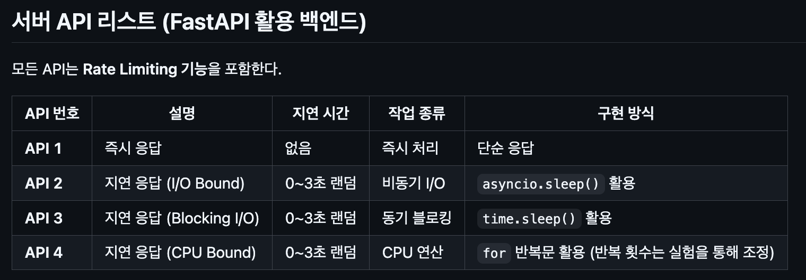
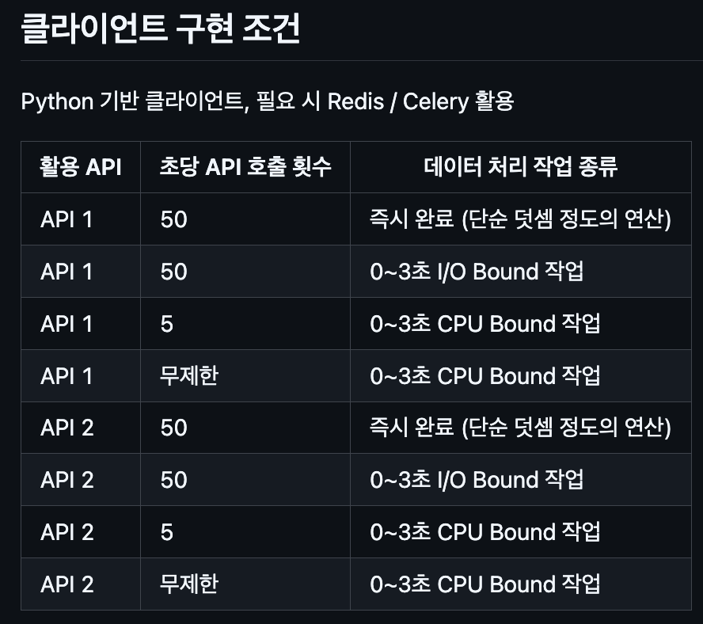

# 동시성 및 병렬성 API 프로젝트

FastAPI 서버와 클라이언트를 통해 동시성 처리 패턴을 학습하는 프로젝트입니다.

## 서버 API 스펙



## 클라이언트 구현 조건



## 테스트 시나리오

클라이언트에서 8가지 테스트 케이스를 제공합니다:

| 번호 | API | 호출 횟수 | 데이터 처리 작업 |
|-----|-----|----------|-----------------|
| 1 | API 1 (즉시 응답) | 50회 | 즉시 완료 (1+1) |
| 2 | API 1 (즉시 응답) | 50회 | I/O Bound (0-3초) |
| 3 | API 1 (즉시 응답) | 5회 | CPU Bound (0-3초) |
| 4 | API 1 (즉시 응답) | 1000회 | CPU Bound (0-3초) |
| 5 | API 2 (비동기 I/O) | 50회 | 즉시 완료 (1+1) |
| 6 | API 2 (비동기 I/O) | 50회 | I/O Bound (0-3초) |
| 7 | API 2 (비동기 I/O) | 5회 | CPU Bound (0-3초) |
| 8 | API 2 (비동기 I/O) | 1000회 | CPU Bound (0-3초) |

## 실행 방법

### 사전 요구사항

- Docker
- Docker Compose

### 실행

```bash
# 1. 서버 백그라운드 실행
docker compose up -d api-server

# 2. 클라이언트 실행
docker compose run --rm client

# 3. 메뉴에서 원하는 테스트 선택 (1-8)

# 4. 종료 (메뉴에서 0 선택)

# 5. 서버 종료
docker compose down
```

### 사용 예시

```
======================================================================
동시성 및 병렬성 API 테스트 클라이언트
======================================================================
1. API 1 (즉시 응답) + 즉시 완료 (50회)
2. API 1 (즉시 응답) + I/O Bound (50회)
3. API 1 (즉시 응답) + CPU Bound (5회)
4. API 1 (즉시 응답) + CPU Bound (무제한)
5. API 2 (비동기 I/O) + 즉시 완료 (50회)
6. API 2 (비동기 I/O) + I/O Bound (50회)
7. API 2 (비동기 I/O) + CPU Bound (5회)
8. API 2 (비동기 I/O) + CPU Bound (무제한)
0. 종료
======================================================================

선택 (0-8):
```
